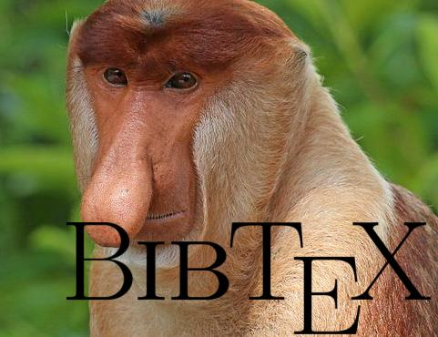

# BibTeX Monkey

A tool for building BibTeX collections.<br><br>



## Description

BibTeX Monkey gets a list of papers in either csv or xlsx format and produces their respective BibTeX database files (.bib).

The input csv or xlsx file should have an `Author` and a `Title` columns. For example, with csv as input:
```csv
Title,Author
Room at the bottom,Richard Feynman
What is science?,Richard Feynman
```

Behind the scenes, BibTeX Monkey uses the free [Crossref](https://www.crossref.org/) service. Please use responsibly.

## Running

### csv

```shell
bibtex-monkey output_dir csv my_resources.csv
```

A csv file can be produce from most spreadsheet editors, such as MS Excel and Google Sheets.

### xlsx

When using xlsx as input, you should provide the paper list's worksheet name.

```shell
bibtex-monkey output_dir xlsx my_resources.xlsx Sheet1
```

## LICENSE
Copyright © 2024 Yoav Orot.

This program is free software: you can redistribute it and/or modify it under the terms of the GNU
General Public License as published by the Free Software Foundation, either version 3 of the
License, or (at your option) any later version.

This program is distributed in the hope that it will be useful, but WITHOUT ANY WARRANTY; without
even the implied warranty of MERCHANTABILITY or FITNESS FOR A PARTICULAR PURPOSE. See the GNU
General Public License for more details.

You should have received a copy of the GNU General Public License along with this program. If not,
see <https://www.gnu.org/licenses/>.
